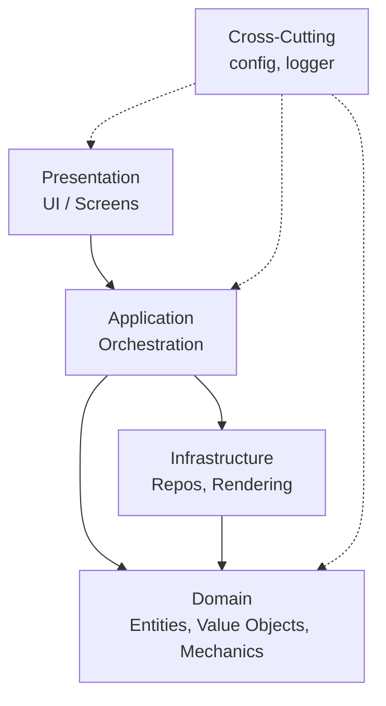

# MAGUS RPG - New Clean Architecture

## Overview

This project has been restructured with a clean, layered architecture for better maintainability and scalability.

### Architecture at a Glance



Data flow (combat setup): Presentation → ScenarioService / UnitSetupService → ScenarioConfig → Battle loop.

## Architecture Layers

### 1. **Domain Layer** (`domain/`)
Core business logic, independent of external concerns.

- **entities/**: Domain entities with identity (Unit, Weapon, etc.)
- **value_objects/**: Immutable value types (Position, CombatStats, Attributes, etc.)
- **mechanics/**: Game rules and calculations (combat, movement, magic) [TODO]
- **services.py**: Domain services (UnitFactory, etc.)

### 2. **Infrastructure Layer** (`infrastructure/`)
External concerns: I/O, data access, rendering.

- **repositories/**: Data access abstractions
  - `CharacterRepository`: Load and cache character JSON
  - `EquipmentRepository`: Load and cache equipment data
  - `SpriteRepository`: Load and cache sprite images
- **rendering/**: Hex grid utilities and rendering helpers
  - `hex_grid.py`: Coordinate conversion, distance calculation

### 3. **Application Layer** (`application/`)
Use cases, orchestration, dependency management.

- `game_context.py`: Dependency injection container
- Service orchestrators [TODO]
- Game state management [TODO]

### 4. **Presentation Layer** (`presentation/`)
UI screens and components.

- **screens/**: Full-screen UI states [TODO]
- **components/**: Reusable UI widgets [TODO]
- `test_screen.py`: Minimal test screen for architecture validation

### 5. **Cross-Cutting**
- **config/**: Centralized configuration and paths
- **logger/**: Logging infrastructure

## Key Design Principles

### Dependency Inversion
- Domain layer has no dependencies on infrastructure
- Dependencies point inward toward domain
- Infrastructure depends on domain interfaces

### Single Responsibility
- Each module has one clear purpose
- Repositories handle data access only
- Services orchestrate business logic
- Entities contain domain behavior

### Immutability Where Possible
- Value objects are frozen dataclasses
- Domain entities use immutable value objects for state
- Reduces side effects and bugs

### Repository Pattern
- Abstracts data access from domain
- Provides caching transparently
- Easy to test with mock repositories

### Factory Pattern
- `UnitFactory` creates properly initialized entities
- Handles complexity of character + equipment + sprite loading
- Centralizes validation and error handling

## Directory Structure

```
MAGUS_pygame/
├── domain/
│   ├── entities/
│   │   └── __init__.py          # Unit, Weapon entities
│   ├── value_objects/
│   │   └── __init__.py          # Position, CombatStats, Attributes, etc.
│   ├── mechanics/               # [TODO] Combat, movement, magic systems
│   └── services.py              # UnitFactory, etc.
│
├── infrastructure/
│   ├── repositories/
│   │   ├── character_repository.py
│   │   ├── equipment_repository.py
│   │   └── sprite_repository.py
│   └── rendering/
│       └── hex_grid.py
│
├── application/
│   └── game_context.py          # Dependency container
│
├── presentation/
│   └── test_screen.py           # Minimal test UI
│
├── config/                      # Configuration (unchanged)
├── logger/                      # Logging (unchanged)
├── old_system/                  # Previous implementation (reference)
│
├── data/
│   └── scenarios/
├── assets/
│   └── sprites/
│       ├── characters/
│       └── backgrounds/
│
└── main.py                      # Entry point (new minimal version)
```

## Current Status

### ✅ Completed
- Domain entities and value objects
- Combat mechanics implemented: damage, reach, weapon wielding, attack resolution, critical/overpower, armor system, stamina with fatigue states
- Repositories for characters, equipment, sprites; scenario loading with spawn zones
- Application services: ScenarioService, UnitSetupService, ActionHandler/ReactionHandler, EquipmentValidationService
- Hex grid utilities and dependency injection container
- Test coverage: 115+ tests across mechanics, stamina, equipment validation, scenario service

### 🚧 In Progress
- Camera/viewport integration into gameplay loop (panning/zoom, map scaling)
- UI screens beyond test screen (scenario selector, deployment, battle HUD)
- Combat feedback polish (logs, icons, condition/stamina visuals)


### 📋 TODO (Next Steps)
1. **Battle/Combat Enhancements**
   - Add ranged/thrown attack resolution and ammunition handling
   - Improve combat feedback (damage/stamina/conditions log and UI cues)
   - Wire camera/zoom into active combat rendering

2. **Scenario & Flow**
   - Scenario generator or quick setup tool
   - Deployment validation and preview UI
   - Integrate scenario selection into front-end screens

3. **UI & Navigation**
   - Build main menu, scenario selector, deployment screen, battle screen
   - Hook existing services into UI components

4. **Data & Save/Load**
   - Character load/edit flow (currently export-only from GM Toolkit)
   - Optional: persist battle/scenario configs for quick replay

## Battle Screen Architecture

### Overview
The battle screen follows a coordinator pattern, separating concerns across multiple specialized components:

### Core Components

**BattleScreen** (505 lines) - Main presentation coordinator
- Manages game loop, input handling, rendering
- Delegates actions to specialized coordinators
- Handles UI state and screen transitions
- No direct combat logic - delegates to BattleService

**BattleActionExecutor** (249 lines) - Action coordination and message formatting
- Executes player actions: attack, move, rotation, facing changes
- **Message Formatting**: Converts domain data (AttackResult) into player-friendly multi-line messages with color coding
- Validates actions before execution
- Provides user feedback through ActionPanel
- Maintains separation: domain returns data, presentation formats it

**UnitPositionManager** (108 lines) - Grid position management
- Character placement and retrieval from hex grid
- Position validation
- Spatial queries (get unit at position)

**FacingChangeManager** (85 lines) - Unit facing coordination
- Validates facing direction changes
- Updates character state
- Integrates with BattleService

**BattleService** (543 lines) - Domain service (Application Layer)
- Pure business logic: combat resolution, movement validation, turn management
- Returns pure data structures (AttackResult, MoveResult)
- No UI concerns or message formatting
- Called by presentation layer coordinators

**ActionPanel** (434 lines) - UI component
- Renders action buttons and combat log
- **Color Tag Parsing**: Parses XML-like color tags and renders multi-colored text
- Displays formatted messages from BattleActionExecutor
- Fixed layout: combat log at 90px from bottom, 60px space for 3-line messages

## Running the Test

```powershell
cd d:\_Projekt\_MAGUS_RPG
poetry run python MAGUS_pygame/main.py
```

**Requirements:**
- Character JSON: `Warri.json` in `characters/` folder (repo level)
- Sprite: `warrior.png` in `assets/sprites/characters/`
- Equipment data: `weapons_and_shields.json` in `Gamemaster_tools/data/equipment/`

**Controls:**
- Arrow keys: Move unit
- R: Rotate unit
- ESC: Exit

## Migration Strategy

The old system is preserved in `old_system/` for reference. Features will be incrementally reimplemented:

1. **Phase 1**: Core entities and data loading ✅
2. **Phase 2**: Combat mechanics
3. **Phase 3**: Battle flow and turn system
4. **Phase 4**: UI screens
5. **Phase 5**: Advanced features (magic, skills, etc.)

## Message Display Architecture

### Color Tag System
The presentation layer uses a custom color tag system for enhanced combat feedback:

**Tag Format:**
- `<purple>text</purple>`: Mandatory ÉP loss from weapon size rule (200, 100, 255)
- `<white>text</white>`: ÉP damage from FP overflow (255, 255, 255)
- `<red>text</red>`: Direct ÉP damage from overpower attacks (255, 100, 100)
- Default: Yellow (255, 220, 100) for normal text

**Message Flow:**
1. **Domain Layer** (`BattleService`): Returns pure data structure (AttackResult)
   - Contains all combat data: rolls, damage, armor, outcomes
   - No message formatting or UI concerns
2. **Presentation Layer** (`BattleActionExecutor`): Formats multi-line messages
   - Converts AttackResult to player-friendly format
   - Applies color tags based on damage source
   - Creates 3-line structured messages:
     ```
     TÉ {all_te} ({attack_roll}) vs VÉ {all_ve} | {Outcome}
     {Zone} (SFÉ:{armor}) | DMG: {pre_armor_damage}
     FP: {fp_damage} | ÉP: <color>{ep_damage}</color>
     ```
3. **UI Layer** (`ActionPanel`): Parses tags and renders colored text
   - Splits message by color tags using regex
   - Calculates proper centering for multi-segment text
   - Renders each segment with appropriate color

**Benefits:**
- Clear separation: Domain handles logic, Presentation handles formatting, UI handles rendering
- Extensible: Easy to add new color tags or message formats
- Testable: Each layer can be tested independently

## Benefits of New Architecture

### Testability
- Domain logic can be tested without pygame
- Repositories can be mocked
- Clear interfaces for dependency injection
- Message formatting isolated from combat logic

### Maintainability
- Clear separation of concerns
- Easy to find and modify code
- Reduced coupling between modules
- UI changes don't affect domain logic

### Extensibility
- Easy to add new features
- Can swap implementations (e.g., different renderers)
- Plugin architecture possible
- Message formats can evolve without touching domain

### Performance
- Built-in caching in repositories
- Lazy loading where appropriate
- Efficient value objects

## Notes

- Hungarian keys from JSON (e.g., "Név", "Erő") are mapped to English internally
- All hex coordinates use cube coordinate system (q, r, s where q+r+s=0)
- Facing is 0-5 (0=North, clockwise)
- Resources (FP/EP) are immutable ResourcePool value objects
